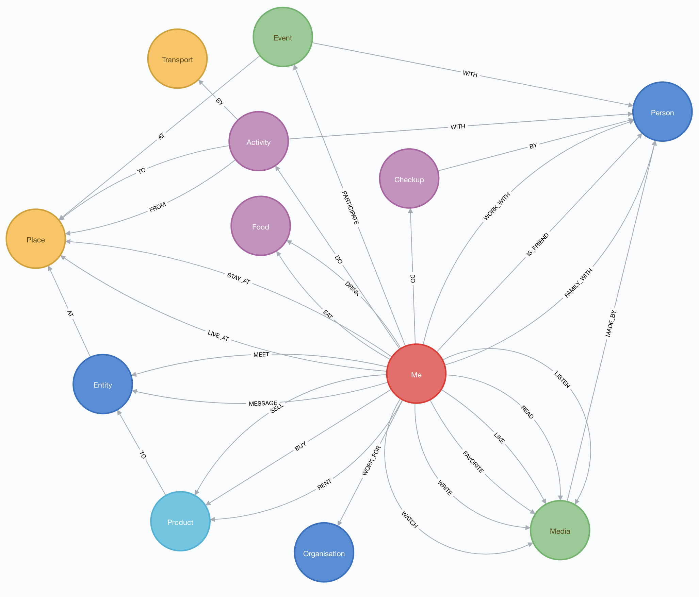

# ONTOLOGIES: OWL + WIDOCO + NETLIFY
This project describes the two ontologies used by https://www.datavillage.me to build the Digital Twins of people and to process these Digital Twins in a fully transparent way.
This project uses WIDICO (https://github.com/dgarijo/Widoco) to generate documentation of ontologies.
The generated ontology websites are automatically deployed on https://www.netlify.com.

## Ontology digital-twin (ONGOING WORK)
It defines the way personal data are organised in the five Digital Twins.
- SOCIAL
- GEOSPATIAL
- KNOWLEDGE&INTEREST
- HEALTH
- CONSUMPTION

Conceptual data model

| Nodes  | Description |
| ------------- | ------------- |
| Me  | The Person who owns the data and performs actions in real life digitized in his DigitalTwin.  |
| Entity | Entity is either a Person either an Organisation. |
| Organisation | An Organisation is an Entity. It’s a corporate, a governmental organisation, Startup, Restaurant, ... |
| Person | A Person is an Entity. |
| Place | A Place is a place represented by an address. |
| Transport | Means of transport used to move from one Location to another | 
| Product | Product Buy|Sell|Rent to an Entity at a specific Place. Products are categorized. |
| Media | Means of communication used by a Person. |
| Event | One thing that happens or happens, especially an important thing, that a person participates with others. |
| Activity | A move activity performed by a Person from one place to another. |
| Food | Any nutritious substance that a Person eat or drink. |
| Checkup | A thorough examination, especially a medical one, to detect any problems. |

Ontology
https://www.datavillage.me/ontologies/digital-twin/

## Ontology LConsent (ONGOING WORK)
It formalizes the way in which consent is organized between the end user and organizations within a user-centric data management system.

https://www.datavillage.me/ontologies/lconsent/

## Deployment
### Make sure widoco jar file is included into your github repository
```
- Download widico executable https://github.com/dgarijo/WIDOCO/releases/tag/v1.4.12
- Include into your git repository
```
### Create your Netlify website
```
- Go to the "Sites" section  
- Create new website by using "New site from Git" button
- Connect with your Github account
- Choose your repository with containing your ontology .owl file
- Create your website
```
### Configure deployment
```
- Go in the "Deploys" section 
- Configure deployment settings by using "Deploy settings" button
- Edit settings
- In the "Build command" put the command: "java -jar PATH-TO-WIDOCO-JAR-IN-YOUR-REPO/widoco-1.4.12-jar-with-dependencies.jar -ontFile PATH-TO-OWL-FILEIN-YOUR-REPO -outFolder OUTPUT-FOLDER-USED-BY_NETLIFY-FOR-SITE-GENERATION -webVowl 
- In the "Publish directory" put OUTPUT-FOLDER-USED-BY_NETLIFY-FOR-SITE-GENERATION
- Save settings
```
### Deploy
```
- Do it manually via "Trigger deploy" button in the "Deploys" section
- Do it automatically by pushing your changes into your git repository on master branch.